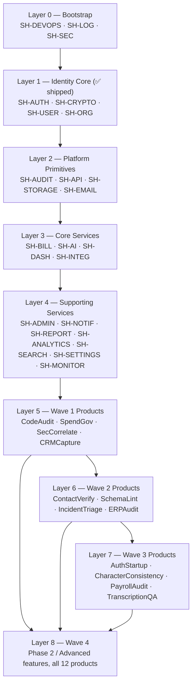
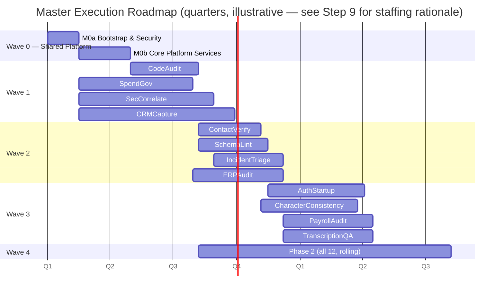

# Master Execution Blueprint — MEGA LOOPING 2D

> Complete implementation blueprint for building all 12 SaaS products on the
> shared platform. This document contains Steps 5–10 of the planning
> request (dependency graph, waves, milestones, roadmap, build order, and
> the final blueprint summary). Steps 1–4 (epic/feature/task identification
> with priority/effort/dependencies) live in `products/execution/*.md` —
> one file per shared platform and per product, referenced throughout.
>
> **This is a planning document only.** No application code was written or
> modified to produce it. No Product Identity Document was changed. No
> product was redesigned — every epic/feature/task below is mined directly
> from the already-approved `PRODUCT_IDENTITY.md` for each product.

## Source documents

| Scope | File |
|---|---|
| Shared Platform (140 tasks) | `products/execution/00-shared-platform-tasks.md` |
| SpendGov (54 tasks) | `products/execution/01-spendgov-tasks.md` |
| SecCorrelate (41 tasks) | `products/execution/02-seccorrelate-tasks.md` |
| CodeAudit (36 tasks) | `products/execution/03-codeaudit-tasks.md` |
| CRMCapture (31 tasks) | `products/execution/04-crmcapture-tasks.md` |
| IncidentTriage (28 tasks) | `products/execution/05-incidenttriage-tasks.md` |
| AuthStartup (34 tasks) | `products/execution/06-authstartup-tasks.md` |
| ERPAudit (26 tasks) | `products/execution/07-erpaudit-tasks.md` |
| ContactVerify (24 tasks) | `products/execution/08-contactverify-tasks.md` |
| CharacterConsistency (24 tasks) | `products/execution/09-characterconsistency-tasks.md` |
| PayrollAudit (23 tasks) | `products/execution/10-payrollaudit-tasks.md` |
| TranscriptionQA (26 tasks) | `products/execution/11-transcriptionqa-tasks.md` |
| SchemaLint (26 tasks) | `products/execution/12-schemalint-tasks.md` |

**Grand total: 513 implementation-ready tasks** (140 shared + 373 product-specific), organized into **101 epics** (22 shared + 79 product) and **~260 features**.

---

## STEP 5 — Dependency Graph

### Layered dependency model

Every task in this portfolio resolves into one of eight layers. A task in layer *N* may depend on any task in layer <*N*, but never on a task in a higher layer — this is what makes the wave sequencing in Step 6 valid rather than arbitrary.

### What blocks what (critical dependency chains)

**Chain A — the true critical path (longest chain in the whole portfolio):**
`SH-DEVOPS-1` (monorepo setup) → `SH-AI-1` (provider abstraction) → `SH-AI-2/3` (routing + structured output) → every product's killer feature (`SG-5.3.1`, `SC-3.2.2`, `CA-3.2.1`, `CR-4.2.2`, `IT-2.2.1`, `AS-4.1.2`, `EA-3.1`, `CV-3.2.1`, `CX-2.1.3`, `PA-3.1`, `TQ-2.1.2`, `SL-3.1`) → that product's accuracy-validation hard gate → general availability.

Every single product's positioning depends on its AI-differentiated feature, and every AI-differentiated feature depends on `SH-AI-1`. **This is the single highest-leverage piece of undone shared work in the entire portfolio** — a delay here delays all 12 products' core value proposition simultaneously, not just one.

**Chain B — billing/monetization:** `SH-ORG-1` → `SH-BILL-1` → `SH-BILL-2` (entitlement resolver) → `SH-BILL-3` (Stripe) → every product's `wire-entitlements-into-SH-BILL` task (`SG-6.2.4`, `SC-5.3.3`, `CA-5.1`, `CR-5.3`, `IT-5.3`, `AS-5.5`, `EA-5.4`, `CV-6.3`, `CX-5.2`, `PA-5.3`, `TQ-5.3`, `SL-5.4`). No product can charge money until this chain clears.

**Chain C — UI surface:** `SH-DASH-1` (shell) → `SH-DASH-2` (component library) → `SH-ADMIN-1` (admin shell) → every product's dashboard/admin epic. No product has a usable UI until this chain clears.

**Chain D — trust gates (per-product, not shared):** Nine of twelve products carry an explicit accuracy/trust validation task that gates general availability regardless of engineering completion elsewhere:

| Product | Gate task | What it validates |
|---|---|---|
| CodeAudit | CA-2.2.3 | >85% SAST precision |
| SecCorrelate | SC-2.2.5 | >90% detection accuracy vs. historical breaches |
| CRMCapture | CR-3.1.3 | Dedup precision/recall |
| IncidentTriage | IT-2.2.3 | >70% directionally-correct root cause hypotheses |
| ERPAudit | EA-2.2.3 | SoD conflict matrix accuracy |
| ContactVerify | CV-2.5, CV-3.2.3 | False-merge rate, health-score calibration |
| CharacterConsistency | CX-2.1.6 | Consistency quality vs. Midjourney/Leonardo.ai (blind A/B) |
| PayrollAudit | PA-2.1.5 | Calculation/tax-rule accuracy (highest-consequence gate in the portfolio) |
| TranscriptionQA | TQ-2.2.2, TQ-2.3.3 | Confidence calibration, domain-dictionary accuracy |
| SchemaLint | SL-3.5 | Recommendation accuracy vs. real production schemas |
| AuthStartup | *(external)* | Independent third-party security audit before GA |

These are **not engineering tasks that can be estimated away** — they're validation gates. A product's timeline is the max of (engineering completion, gate-clearing time), not just engineering completion.

### Cross-product shared-task fan-out

`SH-AUTH`, `SH-ORG`, and `SH-CRYPTO` are already shipped and fan out to all 12 products identically (every product's role-wiring task — e.g. `SG-6.1.1`, `SC-5.3.1`, `EA-5.1` — depends only on `SH-ORG-5`, already done). `SH-AI` and `SH-BILL` are the two undone shared systems with the widest fan-out (12/12 products each) and therefore the two pieces of shared work whose delay has the broadest portfolio-wide impact.

---

## STEP 6 — Development Waves

| Wave | Scope | Products | Rationale |
|---|---|---|---|
| **Wave 0** | Shared Platform Foundation | *(none — infrastructure only)* | Blocks all 12 products. Not optional, not parallelizable with product work. |
| **Wave 1** | First product cohort | CodeAudit, SpendGov, SecCorrelate, CRMCapture | Highest build-priority scores from the Wave 1 portfolio review (`products/PORTFOLIO_WAVE_1_EXECUTION_PLAN.md`); proves the shared platform under real product load; establishes the four buyer-persona GTM motions (dev, finance, security, sales) the rest of the portfolio extends. |
| **Wave 2** | Second product cohort | ContactVerify, SchemaLint, IncidentTriage, ERPAudit | Extends Wave 1's buyer personas (ContactVerify→sales/CRMCapture, SchemaLint→dev/CodeAudit, IncidentTriage→SRE/SecCorrelate, ERPAudit→finance/SpendGov) for cross-sell leverage; moderate-to-low technical risk; no new infrastructure category required. |
| **Wave 3** | Third product cohort | AuthStartup, CharacterConsistency, PayrollAudit, TranscriptionQA | Opens new buyer verticals (dev-tooling-as-product, creative/media, HR/payroll, healthcare/legal) and/or requires new infrastructure (AuthStartup's multi-tenant identity layer, CharacterConsistency's GPU generation pipeline) — sequenced last so the team and platform are mature before taking on net-new complexity. |
| **Wave 4** | Phase 2 / Advanced Features | All 12 products, in parallel, per-product | Every product's "Phase 2" epic (managed SOC, AI Migration Generator, video consistency, fraud detection, adaptive auth, etc. — see each product's task doc). Not a blocking sequential wave: each product enters Wave 4 independently once its own Wave 1/2/3 MVP has shipped and shown initial traction. |

### Why not more/fewer waves

Three product waves of four is a **team-capacity constraint**, not a dependency constraint — see Step 9 for the staffing argument. Nothing here mechanically prevents building all 12 in parallel except headcount and the fact that shared-platform reuse compounds: Wave 2/3 products build on Wave 1's proven billing/dashboard/admin/AI integration patterns, so sequencing captures a real efficiency gain (see the Wave 1 plan's 35–45% time-savings finding, which strengthens further by Wave 3 since three product cohorts' worth of patterns already exist).

---

## STEP 7 — Implementation Milestones

### Milestone M0a — Bootstrap & Security Baseline

- **Goal:** A deployable, secure-by-default foundation exists before any product-facing feature is built.
- **Deliverables:** `SH-DEVOPS-1..5` (monorepo, CI, Docker, env pattern), `SH-LOG-1..3` (structured logging), `SH-SEC-1..4` (CSRF, secure headers, CSP, rate limiting).
- **Dependencies:** None — this is the true Wave 0 starting point.
- **Exit criteria:** CI pipeline runs typecheck/lint/test/build on every PR; every HTTP response carries secure headers by default; every log line is structured JSON with request-ID propagation; a "hello world" product route can be deployed to staging.

### Milestone M0b — Core Platform Services Live

- **Goal:** Every product-agnostic system a product's MVP needs is built and tested.
- **Deliverables:** `SH-BILL-1..9` (billing/entitlements), `SH-AI-1..11` (AI provider abstraction), `SH-DASH-1..8` (dashboard framework), `SH-ADMIN-1..10` (admin shell), `SH-API-1..7`, `SH-STORAGE-1..6`, `SH-INTEG-1..7`.
- **Dependencies:** M0a.
- **Exit criteria:** A product team can scaffold a new product's MVP using only shared-platform primitives for auth, billing, dashboard, admin, and AI — with zero product-specific plumbing beyond domain logic. `SH-AI-1` specifically must support at least one live provider round-trip with structured-output validation before any product's killer-feature epic starts.

### Milestone M1 — Wave 1 Products Live

- **Goal:** CodeAudit, SpendGov, SecCorrelate, and CRMCapture reach general availability, each clearing its accuracy gate.
- **Deliverables:** All P0 tasks in `01-spendgov-tasks.md`, `02-seccorrelate-tasks.md`, `03-codeaudit-tasks.md`, `04-crmcapture-tasks.md`.
- **Dependencies:** M0b (all four products depend on `SH-AI`, `SH-BILL`, `SH-DASH`, `SH-ADMIN`).
- **Exit criteria:** Per PRODUCT_IDENTITY §30/success-criteria for each product — CA-2.2.3 (>85% SAST precision), SC-2.2.5 (>90% detection accuracy), CR-3.1.3 (dedup precision validated), and SpendGov's 3 reference customers each documenting $1M+ recovered waste. Matches the exit bar already defined in `products/PORTFOLIO_WAVE_1_EXECUTION_PLAN.md`.

### Milestone M2 — Wave 2 Products Live

- **Goal:** ContactVerify, SchemaLint, IncidentTriage, and ERPAudit reach general availability.
- **Deliverables:** All P0 tasks in `08-contactverify-tasks.md`, `12-schemalint-tasks.md`, `05-incidenttriage-tasks.md`, `07-erpaudit-tasks.md`.
- **Dependencies:** M1 (reuses Wave 1's proven billing/dashboard/AI integration patterns; ContactVerify and IncidentTriage specifically benefit from CRMCapture's and SecCorrelate's shipped connector patterns).
- **Exit criteria:** CV-2.5 (false-merge rate <1%), SL-3.5 (recommendation accuracy validated by design partners), IT-2.2.3 (>70% directionally-correct root cause), EA-2.2.3 (SoD accuracy validated) — each product's specific gate from Step 5's Chain D table.

### Milestone M3 — Wave 3 Products Live

- **Goal:** AuthStartup, CharacterConsistency, PayrollAudit, and TranscriptionQA reach general availability.
- **Deliverables:** All P0 tasks in `06-authstartup-tasks.md`, `09-characterconsistency-tasks.md`, `10-payrollaudit-tasks.md`, `11-transcriptionqa-tasks.md`.
- **Dependencies:** M2, plus two Wave-3-specific prerequisites: AS-1.1.1 (multi-tenant architecture decision) must resolve before any AuthStartup engineering starts, and CX-1.1 (GPU infrastructure) must exist before any CharacterConsistency generation feature starts.
- **Exit criteria:** PA-2.1.5 (payroll calculation accuracy — the highest-consequence gate in the portfolio), TQ-2.2.2/TQ-2.3.3 (confidence calibration, dictionary accuracy), CX-2.1.6 (consistency benchmark beats general-purpose tools), and AuthStartup's independent security audit passing with zero critical findings.

### Milestone M4 — Full Portfolio Phase 2 Expansion

- **Goal:** Every product's Phase 2 epic (managed services, advanced AI, enterprise-tier expansion) ships, driven by post-launch traction data rather than a fixed pre-commitment.
- **Deliverables:** All P1/P2 tasks across all 12 product task documents' "Phase 2" epics (SC-4/SC-6, CA-3.3, IT-3, EA— custom rules, CV-5.3, CX-4, PA-3.3/3.5, TQ-4, SL-4, AS-4.2).
- **Dependencies:** Per-product — each product's own M1/M2/M3 milestone, not a portfolio-wide gate.
- **Exit criteria:** Defined per-product against the revenue/expansion targets already set in each PRODUCT_IDENTITY §26 (e.g. SecCorrelate's managed-SOC beta with 3 customers, SpendGov's success-based pricing option live).

---

## STEP 8 — Master Execution Roadmap

### What can be built in parallel

- **Within Wave 0:** `SH-LOG`, `SH-SEC`, and `SH-DEVOPS` bootstrap tasks are largely parallel across engineers (different files, no shared state). `SH-BILL`, `SH-AI`, `SH-DASH`, and `SH-INTEG` in M0b are four independent workstreams that only converge at `SH-ADMIN` and each product's entitlement-wiring task — staff them as four parallel pods.
- **Within Wave 1:** Once M0b clears, all four products can start simultaneously if staffed independently (the Wave 1 plan's staggered start — Week 1/6/14/20 — was a *staffing* choice to let learnings cascade, not a hard dependency; a larger team could run all four in parallel from the same start date).
- **Across waves:** Wave 2 does not have to wait for Wave 1's Phase 2 work — only for Wave 1's *MVP* (P0 tasks) and the shared-platform patterns it establishes. A team with enough capacity could start Wave 2's engineering the moment Wave 1's M0b-dependent core is stable, even before Wave 1's accuracy gates clear (the gates block *that product's* GA, not other products' engineering).
- **Wave 3's two infrastructure-heavy products (AuthStartup, CharacterConsistency) can run fully in parallel with each other** — they share no dependencies and use different specialist skill sets (identity/security engineering vs. ML/GPU engineering).
- **Wave 4 is inherently parallel** — each product's Phase 2 epic is independent of every other product's, gated only by that product's own MVP traction, not by a portfolio-wide milestone.

---

## STEP 9 — Recommended Optimal Build Order

### 1. Shared Platform Foundation, in this internal order:

**Bootstrap → Identity (already done) → Billing + AI + Dashboard + Integrations (parallel pods) → Admin/Notifications/Reporting/Analytics/Search/Settings/Monitoring.**

**Why:** Bootstrap (`SH-DEVOPS`, `SH-LOG`, `SH-SEC`) is cheap (S/M effort tasks) and blocks literally everything downstream, including local development — it goes first regardless of what else is prioritized. Billing, AI, Dashboard, and Integrations are the four systems every single product's MVP touches (per the fan-out analysis in Step 5) and have no dependencies on each other, so they run as four parallel pods rather than sequentially. Admin, Notifications, Reporting, Analytics, Search, and Settings are real but lower-urgency — most are P1, several (SH-ADMIN's sub-modules) are literally just thin UI over already-built services, and none block a product's *first* customer the way Billing/AI/Dashboard do.

### 2. Wave 1: CodeAudit → SpendGov → SecCorrelate → CRMCapture

**Why (unchanged from the prior Wave 1 portfolio review, still valid):** CodeAudit has the fastest MVP, the largest TAM, a freemium motion that proves the shared platform's billing/entitlement system under real self-serve load, and the lowest technical risk of the four (no accuracy-critical trust gate as severe as SecCorrelate's). SpendGov follows with strong revenue economics and reference-customer-driven enterprise sales. SecCorrelate carries the highest technical risk in Wave 1 (detection-accuracy gate) and benefits from starting third, after the team has shipped two products' worth of shared-platform integration experience. CRMCapture is fourth because its reference customers are hardest to win without the credibility three prior shipped products provide.

### 3. Wave 2: ContactVerify → SchemaLint → IncidentTriage → ERPAudit

**Why:** ContactVerify is the single easiest technical build in the entire portfolio (§27 rating 4/5) and has the tightest GTM synergy with the just-shipped CRMCapture (same sales/marketing buyer, near-identical PLG motion) — shipping it first captures cross-sell momentum while it's freshest. SchemaLint follows, extending CodeAudit's developer buyer with a moderate-risk build. IncidentTriage extends SecCorrelate's SRE/security-adjacent buyer. ERPAudit goes last in this wave because it carries the hardest technical gate of the four (SoD conflict-matrix accuracy) and benefits from the most runway, and its finance/audit buyer synergy with SpendGov means it doesn't need first-mover urgency the way ContactVerify's cross-sell window does.

### 4. Wave 3: AuthStartup + CharacterConsistency (parallel) → PayrollAudit + TranscriptionQA (parallel)

**Why parallel pairs instead of a strict sequence:** AuthStartup and CharacterConsistency share zero dependencies and draw on different specialist skills (identity/security vs. ML/GPU engineering), so running them as two independent tracks is strictly faster than sequencing them, with no coordination cost. Within that pair, AuthStartup starts its external security-audit procurement immediately (long, non-engineering lead time) so the audit isn't the tail-end bottleneck; CharacterConsistency starts its GPU infrastructure buildout in parallel since it's likewise a long-lead, non-blocking-for-other-work item. PayrollAudit and TranscriptionQA form the second pair for the same reason — no shared dependency, and both need extended design-partner validation runway for their respective accuracy gates (payroll calculation correctness; confidence-score calibration), so starting them together maximizes the validation window without stealing time from each other.

### 5. Wave 4: driven by traction data, not a pre-committed order

**Why no fixed order:** Unlike Waves 1–3, Phase 2 expansion work should be prioritized by which product's MVP shows the strongest post-launch signal (conversion rate, expansion revenue, customer-requested features) — pre-committing an order here would substitute planning-time guesses for real usage data that will exist by the time Wave 4 starts for any given product.

---

## STEP 10 — Final Execution Blueprint

### ✓ Epic List

101 epics total: 22 shared-platform epics (`SH-AUTH` through `SH-DEVOPS`, see `00-shared-platform-tasks.md`) + 79 product epics (5–8 per product across all 12 products, see each product's task document). Full epic names and goals are listed at the top of each `##` section in the 13 source documents.

### ✓ Feature List

~260 features grouped under the 101 epics above — each epic's `###` subsections in the source documents.

### ✓ Task List

513 implementation-ready tasks with Priority (P0/P1/P2), Effort (S/M/L), Dependencies, and Parallel flag — the `|` tables in every source document. Every task traces to a specific line in its product's `PRODUCT_IDENTITY.md` §7 or §18 (or, for shared tasks, to a named system in `frameworks/`/`standards/`), per the no-invention rule for this planning exercise.

### ✓ Shared Tasks

140 tasks across 22 shared-platform epics, detailed in `00-shared-platform-tasks.md`, with 23 already shipped (Authentication, User Management, Organizations/Teams/RBAC, Encryption, and the audit-log write path — verified in `shared/platform/` with passing tests per the prior session).

### ✓ Dependency Graph

Layered model (Step 5) with the critical path identified (`SH-DEVOPS-1` → `SH-AI` → every product's killer feature → that product's accuracy gate → GA) and the two highest-fan-out undone shared systems flagged (`SH-AI`, `SH-BILL`, both touching all 12 products).

### ✓ Milestones

Six milestones (M0a, M0b, M1, M2, M3, M4) each with Goal, Deliverables, Dependencies, and Exit Criteria (Step 7), with exit criteria tied directly to the accuracy/trust gates already defined in each product's own `PRODUCT_IDENTITY.md` §30 — this blueprint does not invent new success bars, it sequences the ones the product docs already committed to.

### ✓ Development Waves

Wave 0 (shared foundation) + Waves 1–4 (Step 6), matching the requested four-wave product template plus the necessary Wave 0 infrastructure prerequisite the request's own dependency logic requires.

### ✓ Parallel Build Plan

Documented at three levels (Step 8): within Wave 0 (four parallel core-service pods), within Wave 1 (four products parallelizable given sufficient staffing), and within Wave 3 (two independent parallel pairs).

### ✓ Final Execution Order

Shared Platform Foundation → CodeAudit → SpendGov → SecCorrelate → CRMCapture → ContactVerify → SchemaLint → IncidentTriage → ERPAudit → {AuthStartup ∥ CharacterConsistency} → {PayrollAudit ∥ TranscriptionQA} → Wave 4 (traction-driven, per-product), with full rationale in Step 9.

---

## What this blueprint deliberately does not do

Per the task's explicit rules: no application code was written, no Product Identity Document was modified, and no product was redesigned. Every epic, feature, and task above was mined from the already-approved 12 `PRODUCT_IDENTITY.md` files and the already-shipped `shared/platform/` code — this document sequences and structures existing decisions, it does not make new product decisions. Where a genuine open architecture question exists (AuthStartup's multi-tenant data model, `SH-AI`'s specific provider choice), it's flagged as a task to resolve, not silently decided here.
