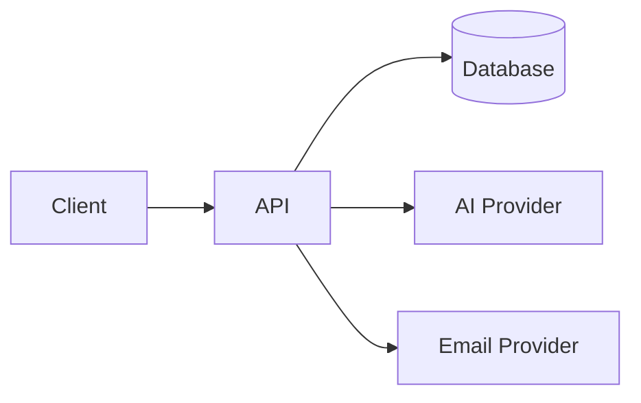

# Architecture — <Product Name>

## Overview

<2–4 sentences: the system's shape at a glance.>

## Components

| Component | Responsibility | Tech |
|---|---|---|
| Frontend | | Next.js / React |
| API | | Next.js route handlers / <service> |
| Database | | PostgreSQL |
| Auth | | <provider/library> |
| AI layer | | <provider abstraction, see `standards/ai.md`> |
| Background jobs | | <queue/scheduler, if any> |

## Data flow

<Replace with the product's real flow — request path for the core
workflow, including where auth/authorization checks happen.>

## Multi-tenancy model

<Single-tenant / multi-tenant with org scoping / etc. Reference
`standards/database.md` for the scoping pattern used.>

## Key technical decisions

<Bullet list linking to the relevant ADRs in `decisions/`, not a
restatement of them.>

- <Decision> — see [`decisions/0001-<slug>.md`](./decisions/0001-<slug>.md)

## Integration points (Phase 2)

| Integration | Purpose | Status |
|---|---|---|
| <e.g. Stripe> | Billing | Built, disabled — no credentials |
| <e.g. Google OAuth> | Social login | Built, disabled — no credentials |
| <e.g. Resend/SendGrid> | Transactional email | Built, disabled — no credentials |

## Deviations from global standards

<Anything this product intentionally does differently from
`/standards`, and why. Should be rare — if you're writing a lot here,
reconsider whether it belongs in the global standard instead.>
